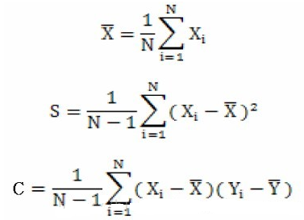
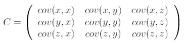
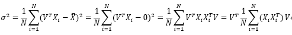
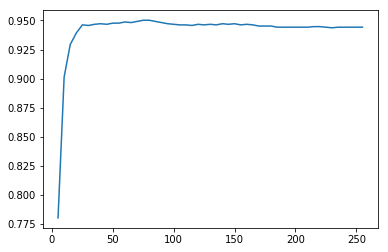
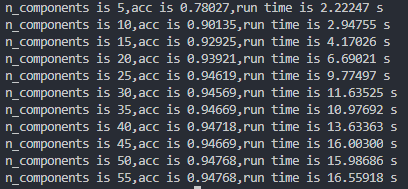

# PCA
## PCA简介
降维是对数据高维度特征的一种预处理方法。降维是将高维度的数据保留下最重要的一些特征，去除噪声和不重要的特征，从而实现提升数据处理速度和提高后续分类等其他操作的效果。在这里关于PCA的目的和必要性就不再赘述，下面直接来看PCA的过程。
## PCA降维过程
通过计算数据矩阵的协方差矩阵，得到协方差矩阵的特征值和特征向量，选择特征值最大（即方差最大）的N个特征所对应的特征向量组成降维矩阵，然后利用降维矩阵，将原始数据矩阵转换到新的空间中。这样就完成了降维的目的，同时保留了数据最重要的信息（因为数据的最大方差给出了原始数据最重要的信息）。   
***
PCA伪代码：   
1.将每个特征变量去除平均值；  
2.计算协方差矩阵；  
3.计算协方差矩阵的特征值和特征向量；  
4.保留前N个最大的特征值对应的特征向量，组成降维矩阵；  
5.利用降维矩阵，将原始数据投影到新的空间中。  
***
下面，我们来一步步分解PCA的过程。  
1.首先，需要对每个特征变量去除均值，这一步的目的是使得变量的数学期望为0。这个数学期望会在协方差矩阵中用到。但是，这一步去除均值是非必要的！也就是变量不需要去除均值也可以实现PCA降维；  
**注意：这里的均值指的是训练集的均值，即不论是训练数据还是测试数据，要减去的是同一个均值（训练集数据均值）**
```python
train_mean = data.mean(axis = 0)
meanRemoved = data-train_mean
test_Mat = data1-train_mean
```
2.这一步需要计算协方差矩阵。那么什么是协方差矩阵呢？下面给出均值X、方差S和协方差C的公式：  
  
比较S和C，可以看出，方差是针对同一个变量而言的，协方差是针对不同变量而言的。上式中计算协方差的变量为(X,Y)，如果是3维数据(X,Y,Z)，则它们的协方差就变成了协方差矩阵，如下图所示：  
  
明白了协方差矩阵的意义之后，我们来证明为什么需要计算协方差矩阵。  
PCA的目标是为了最大化方差，下面给出方差的公式：  
  
最后一步的中间部分，很明显就是协方差的表达方式了。这一步我们可以直接使用numpy包中的cov()方法求协方差矩阵，也可以直接根据上图公式中的最后一个表达式，直接对原始数据X计算X.T与X的矩阵乘积。  
```
covMat = np.cov(meanRemoved,rowvar=0)
conMat = np.matmul(meanRemoved.T,meanRemoved)/data.shape[0]
```
3.求出协方差矩阵后，就是对协方差矩阵求解特征值和特征向量。这一步我们使用numpy包中的linalg.eig()方法来求解。  
```python
eigVals,eigVecs = np.linalg.eig(covMat)
```
4.之后就是根据求解的特征值的大小，保留前N个最大的特征值对应的特征向量，构成降维矩阵。这一步的代码如下,其中n_components表示要将原始数据降到多少维。  
```python
idx = np.argsort(eigVals)[::-1][:n_components]
reserveVec = eigVecs[:,idx]
```
5.将原始数据利用降维矩阵映射到新的空间中，得到降维后的数据。  
```
lowDataMat = np.matmul(meanRemoved,reserveVec)
```
**注意：当我们对测试数据进行降维的时候，利用的也是这个由训练集求出来的降维矩阵，而不是再利用训练数据重新求得降维矩阵进行降维，我第一次PCA预测数据失败就是这个问题，所以特此记录。**
## PCA结果
这样，整个PCA的过程就结束了，后面我利用手写数据集对PCA进行测试，下图是对数据集进行不同程度的降维之后再进行预测。横坐标代表降低到多少维，纵坐标为准确率。最终得到的准确率最高达到94.7%。



